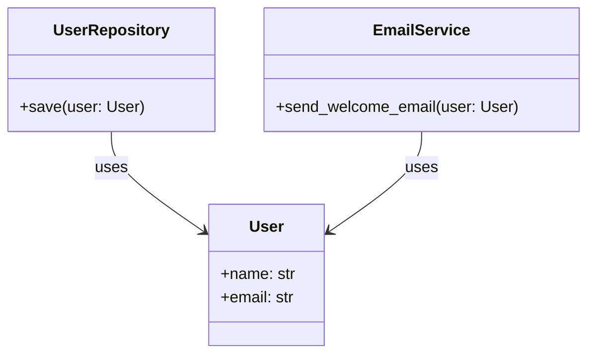

# SRP Example Implementation

## Concept

The Single Responsibility Principle says: **a class should have only one reason to change**. If a class handles user data, saves to a database, AND sends emails, it has three reasons to change — violating SRP.

## Example Structure

We'll build the example in `[solidPrinciples/0_srp_single_responsiblity_principle.py](solidPrinciples/0_srp_single_responsiblity_principle.py)` with two sections:

### 1. Bad Example (Violating SRP)

A single `User` class that does everything — holds user data, saves to DB, and sends email:

```python
class User:
    def __init__(self, name, email):
        self.name = name
        self.email = email

    def save_to_db(self):
        print(f"Saving {self.name} to database")

    def send_welcome_email(self):
        print(f"Sending welcome email to {self.email}")
```

This class has **three reasons to change**: user data changes, DB logic changes, or email logic changes.

### 2. Good Example (Following SRP)

Split into three classes, each with a single responsibility:

- **User** — only holds user data
- **UserRepository** — only handles persistence (saving/fetching from DB)
- **EmailService** — only handles sending emails




### 3. Demo Section

A `if __name__ == "__main__"` block that demonstrates both approaches so you can run the file and see the output.

## Key Takeaway to Include

Each class now has exactly **one reason to change**:

- `User` changes only if user attributes change
- `UserRepository` changes only if DB logic changes
- `EmailService` changes only if email logic changes

